# Desafio Terraform e AWS

Repositório para salvar as evidências referentes ao desafio de Terraform e AWS do Bootcamp de DevOps da Atlântico Avanti.

**Autor**: Sylvio Castanho Jr.

## 1 Autenticação AWS

OBS: após a criação da conta AWS, foi ativada a autenticação em 2 fatores (MFA) para o usuário root.

Para esse desafio optou-se por configurar um método de autenticação terminal -> AWS sem o uso de chaves estáticas por questão de segurança. Para isso, autenticados como o usuário root habilitamos o AWS IAM Identity Center no modo [organization instance](https://docs.aws.amazon.com/singlesignon/latest/userguide/get-set-up-for-idc.html), que é uma opção gratuita.

Em seguida, em Multi-account permissions > Permission sets, criamos 2 novos permission sets: AdministratorAccess e ReadOnlyAccess, com Session Duration de 1h.


Após, em Users > Add user, foi criado um novo usuário de nome svajr90 e as instruções para definição do password foram enviadas em seu email. Esse é o email que chegou para o usuário:

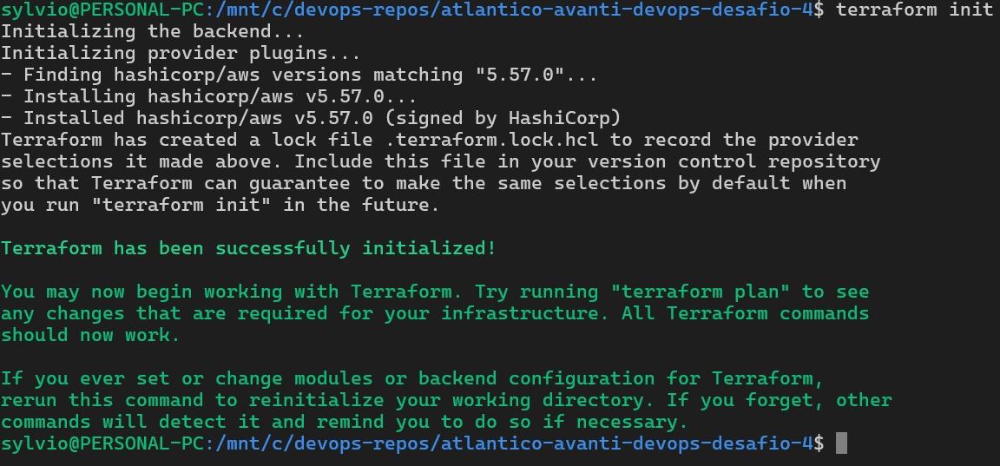


Como é uma conta de uso pessoal, não foi criado nenhum grupo, apenas esse usuário. Após o primeiro login clicando no link do email, também foi ativado o MFA para esse usuário:

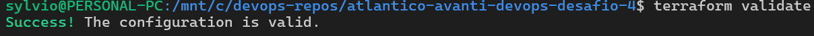

Após, clicou-se em Multi-account permissions > AWS accounts > Conta 'Sylvio Castanho Jr' (management account) > Assign users or groups > Users > Selecionado svacjr90 > Next > Selecionados os 2 permission sets criados (AdministratorAccess e ReadOnlyAccess) > Next > Submit.

Com isso, ao acessar o portal de login tenho acesso a conta com dois tipos de permissões, sem usar o usuário root:


Voltando ao terminal, foi executado o comando `aws configure sso` com as opções abaixo e depois `export AWS_PROFILE=admin`:

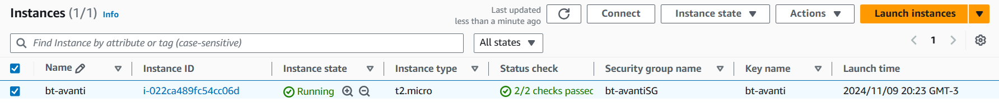

Dessa forma, posso me autenticar com o Terraform na AWS sem precisar usar chaves estáticas, obtendo melhorias na segurança do processo de autenticação.


## 2 Instalação do Terraform

O Terraform foi instalado segundo as instruções do site oficial para Linux Ubuntu: https://developer.hashicorp.com/terraform/tutorials/aws-get-started/install-cli. Abaixo a versão disponível após instalação:

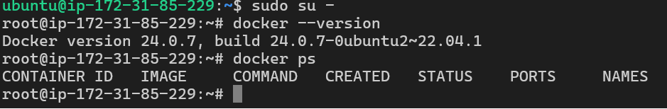

Para facilitar a escrita do código também foi instalada a extensão oficial do Terraform no VSCode (Hashicorp Terraform):


## 3 Criação da key pair na AWS

No portal da AWS em EC2 > Networking & Security > Key pairs foi criado um novo par de chaves do tipo RSA .pem com nome `bt-avanti`.

## 3 Configuração do código Terraform

Inicialmente foi clonado o repositório exemplo do desafio: https://github.com/luizcarlos16/bt-dvp-v2-terraform. Seu conteúdo foi copiado para esse repositório atual.

Algumas modificações foram feitas:

### 3.1 Configuração de locals para user_data

O Terraform possui um recurso chamado [Local values](https://developer.hashicorp.com/terraform/language/values/locals) que permite a configuração de variáveis locais.

Foi criado um arquivo `locals.tf` para manter o conteúdo do user_data para a EC2, removendo a necessidade de manter o `script.sh` no repositório.

### 3.2 Configuração de auto.tfvars

Visando não expor meu IP no repositório, foi criado um arquivo `default.auto.tfvars` e em seguida adicionada a linha `*.auto.tfvars` no `.gitignore` do repositório. Nesse arquivo salvei meu IP no seguinte formato:

```
my_ip = "<IP>/32"
```

### 3.3 Melhoria no Security Group

Em seguida defini essa variável no arquivo `variables.tf` e utilizei ela para melhorar a segurança do security group, permitindo acesso/ingress a EC2 apenas a partir do meu IP.

### 3.4 Configuração das tags

Adicionei o bloco [default_tags](https://developer.hashicorp.com/terraform/tutorials/aws/aws-default-tags) na configuração do provider `aws` em `main.tf`, com as tags `Name` e `Desafio`. Essas tags serão adicionadas as tags especificadas individualmente nos recursos.

### 3.5 Mais variáveis

Para melhorar a parametrização do código, criei novas variáveis no `variables.tf`: `key_name`, `instance_type` e `ami`. Em seguida criei o arquivo `default.tfvars`, que não está no `.gitignore`, e adicionei seus valores nele.


## 4 Operações com o Terraform

Primeiro formatei o código utilizando o comando [terraform fmt](https://developer.hashicorp.com/terraform/cli/commands/fmt).


Em seguida rodei `terraform init`:

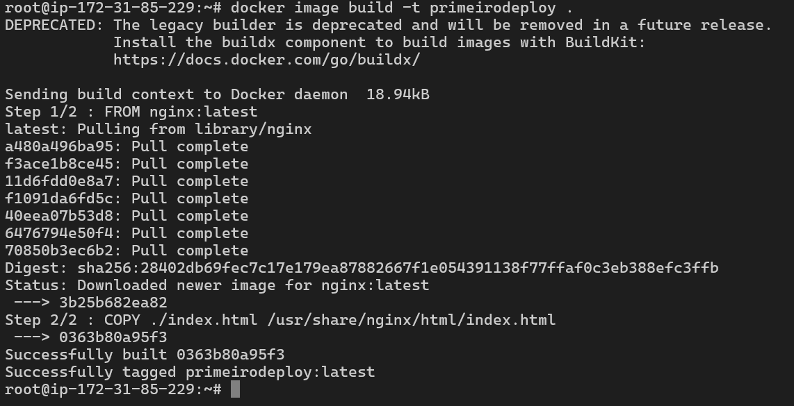

Depois executei `terraform validate`, que também é uma boa prática:

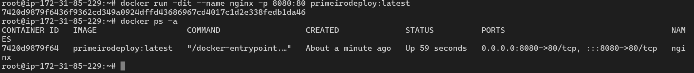

Depois, `terraform plan -var-file=default.tfvars`, utilizando a flag para indicar o arquivo das variáveis não sensíveis (o `.auto.tfvars` é detectado automaticamente). Esse foi o resultado:

<details>

<summary>(clicar na setinha para expandir)</summary>

```
Terraform used the selected providers to generate the following execution plan. Resource actions are indicated with the following symbols:
  + create

Terraform will perform the following actions:

  # aws_instance.web-server-2 will be created
  + resource "aws_instance" "web-server-2" {
      + ami                                  = "ami-0a0e5d9c7acc336f1"
      + arn                                  = (known after apply)
      + associate_public_ip_address          = (known after apply)
      + availability_zone                    = (known after apply)
      + cpu_core_count                       = (known after apply)
      + cpu_threads_per_core                 = (known after apply)
      + disable_api_stop                     = (known after apply)
      + disable_api_termination              = (known after apply)
      + ebs_optimized                        = (known after apply)
      + get_password_data                    = false
      + host_id                              = (known after apply)
      + host_resource_group_arn              = (known after apply)
      + iam_instance_profile                 = (known after apply)
      + id                                   = (known after apply)
      + instance_initiated_shutdown_behavior = (known after apply)
      + instance_lifecycle                   = (known after apply)
      + instance_state                       = (known after apply)
      + instance_type                        = "t2.micro"
      + ipv6_address_count                   = (known after apply)
      + ipv6_addresses                       = (known after apply)
      + key_name                             = "bt-avanti"
      + monitoring                           = (known after apply)
      + outpost_arn                          = (known after apply)
      + password_data                        = (known after apply)
      + placement_group                      = (known after apply)
      + placement_partition_number           = (known after apply)
      + primary_network_interface_id         = (known after apply)
      + private_dns                          = (known after apply)
      + private_ip                           = (known after apply)
      + public_dns                           = (known after apply)
      + public_ip                            = (known after apply)
      + secondary_private_ips                = (known after apply)
      + security_groups                      = (known after apply)
      + source_dest_check                    = true
      + spot_instance_request_id             = (known after apply)
      + subnet_id                            = (known after apply)
      + tags                                 = {
          + "Type" = "web-server"
        }
      + tags_all                             = {
          + "Desafio" = "2"
          + "Name"    = "bt-avanti"
          + "Type"    = "web-server"
        }
      + tenancy                              = (known after apply)
      + user_data                            = "a4f9fa5b07045be4fb614bcd07af89048fb9e164"
      + user_data_base64                     = (known after apply)
      + user_data_replace_on_change          = false
      + vpc_security_group_ids               = (known after apply)

      + capacity_reservation_specification (known after apply)

      + cpu_options (known after apply)

      + ebs_block_device (known after apply)

      + enclave_options (known after apply)

      + ephemeral_block_device (known after apply)

      + instance_market_options (known after apply)

      + maintenance_options (known after apply)

      + metadata_options (known after apply)

      + network_interface (known after apply)

      + private_dns_name_options (known after apply)

      + root_block_device (known after apply)
    }

  # aws_security_group.bt-avantiSG will be created
  + resource "aws_security_group" "bt-avantiSG" {
      + arn                    = (known after apply)
      + description            = "Allow incoming HTTP, HTTPS e SSH connections."
      + egress                 = [
          + {
              + cidr_blocks      = [
                  + "0.0.0.0/0",
                ]
              + from_port        = 0
              + ipv6_cidr_blocks = []
              + prefix_list_ids  = []
              + protocol         = "-1"
              + security_groups  = []
              + self             = false
              + to_port          = 0
                # (1 unchanged attribute hidden)
            },
        ]
      + id                     = (known after apply)
      + ingress                = [
          + {
              + cidr_blocks      = [
                  + "(meu-ip)/32",
                ]
              + description      = "HTTP to EC2"
              + from_port        = 80
              + ipv6_cidr_blocks = []
              + prefix_list_ids  = []
              + protocol         = "tcp"
              + security_groups  = []
              + self             = false
              + to_port          = 80
            },
          + {
              + cidr_blocks      = [
                  + "(meu-ip)/32",
                ]
              + description      = "HTTPS to EC2"
              + from_port        = 443
              + ipv6_cidr_blocks = []
              + prefix_list_ids  = []
              + protocol         = "tcp"
              + security_groups  = []
              + self             = false
              + to_port          = 443
            },
          + {
              + cidr_blocks      = [
                  + "(meu-ip)/32",
                ]
              + description      = "SSH to EC2"
              + from_port        = 22
              + ipv6_cidr_blocks = []
              + prefix_list_ids  = []
              + protocol         = "tcp"
              + security_groups  = []
              + self             = false
              + to_port          = 22
            },
        ]
      + name                   = "bt-avantiSG"
      + name_prefix            = (known after apply)
      + owner_id               = (known after apply)
      + revoke_rules_on_delete = false
      + tags                   = {
          + "Type" = "security-group"
        }
      + tags_all               = {
          + "Desafio" = "2"
          + "Name"    = "bt-avanti"
          + "Type"    = "security-group"
        }
      + vpc_id                 = (known after apply)
    }

Plan: 2 to add, 0 to change, 0 to destroy.
```

</details>


Após revisar e parecer ok, executei o `terraform apply -var-file=default.tfvars`, confirmando a operação:

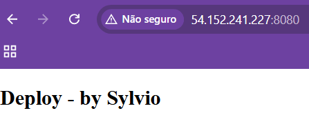


## Validando o resultado

Verificou-se que a EC2 foi criada com sucesso:

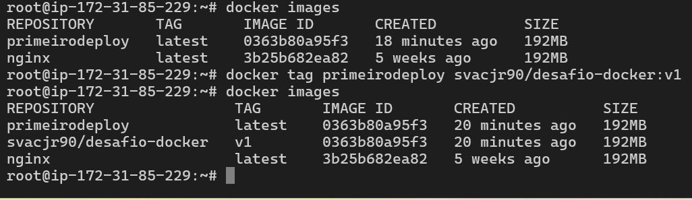

Também foi possível se conectar com a EC2 utilizando SSH:

```
chmod 400 "bt-avanti.pem" #(precisei mover a chave do /mnt/ para ~/ no WSL pois esse comando é para Linux)
ssh -i "bt-avanti.pem" ubuntu@ec2-(ip)-compute-1.amazonaws.com
```

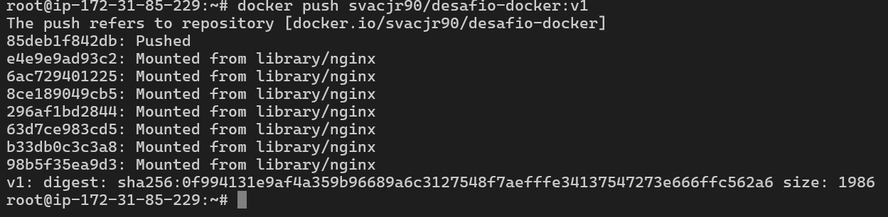

Checando o website no navegador:

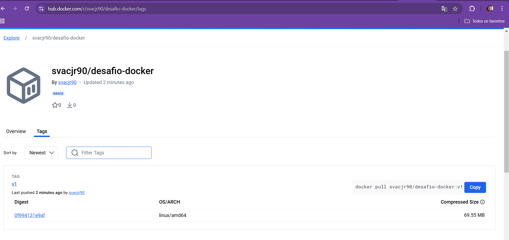

## Terraform destroy 

Para remover a EC2 e o Security Group foi executado `terraform destroy -var-file=default.tfvars`:

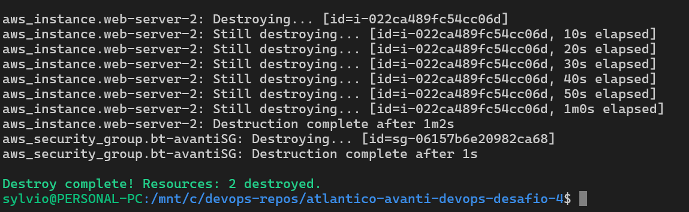

E `aws sso logout` no final.

